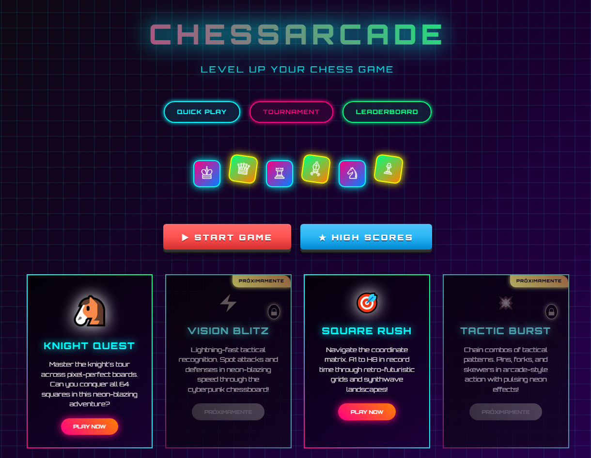
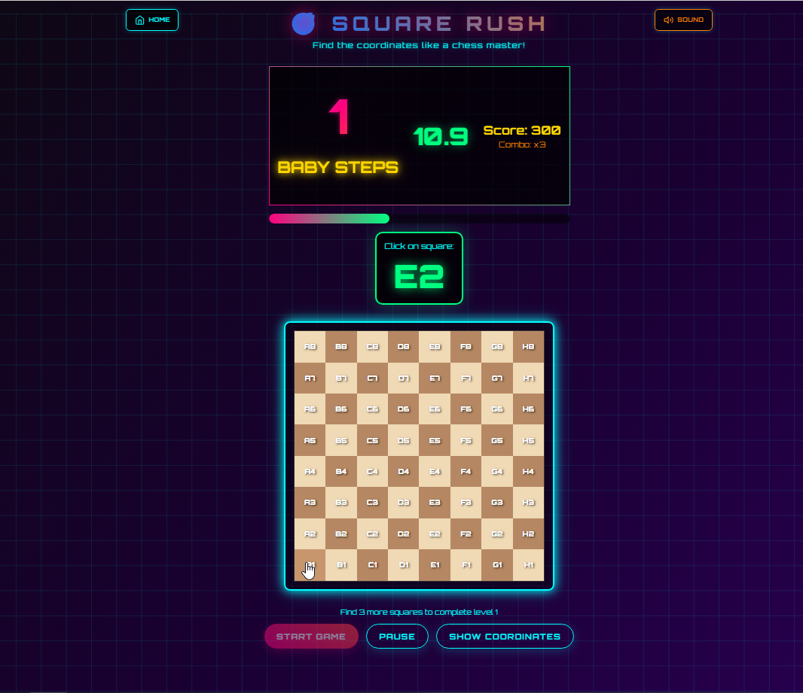
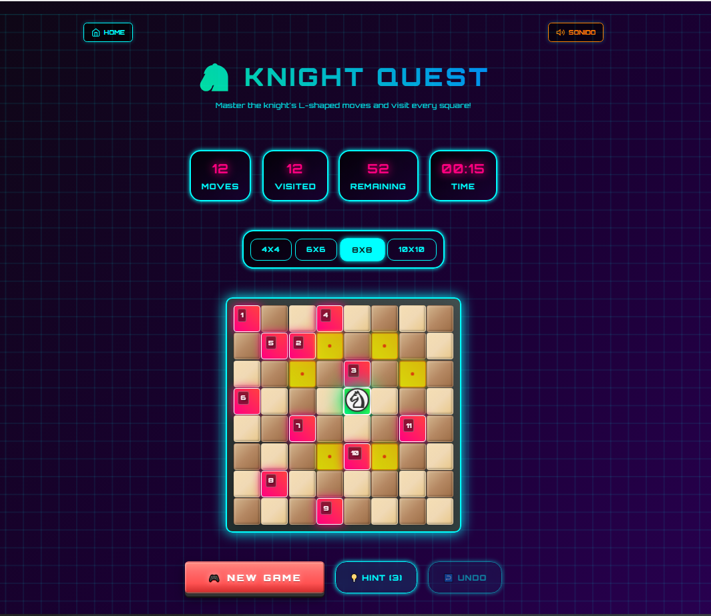
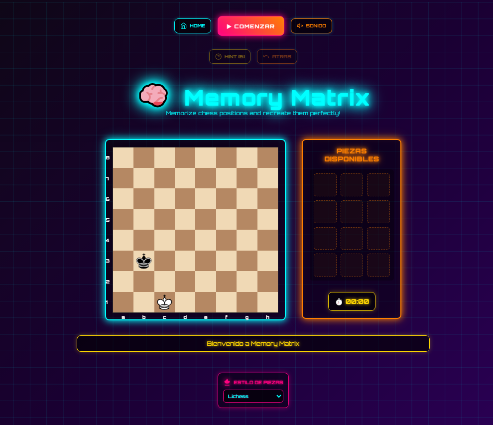
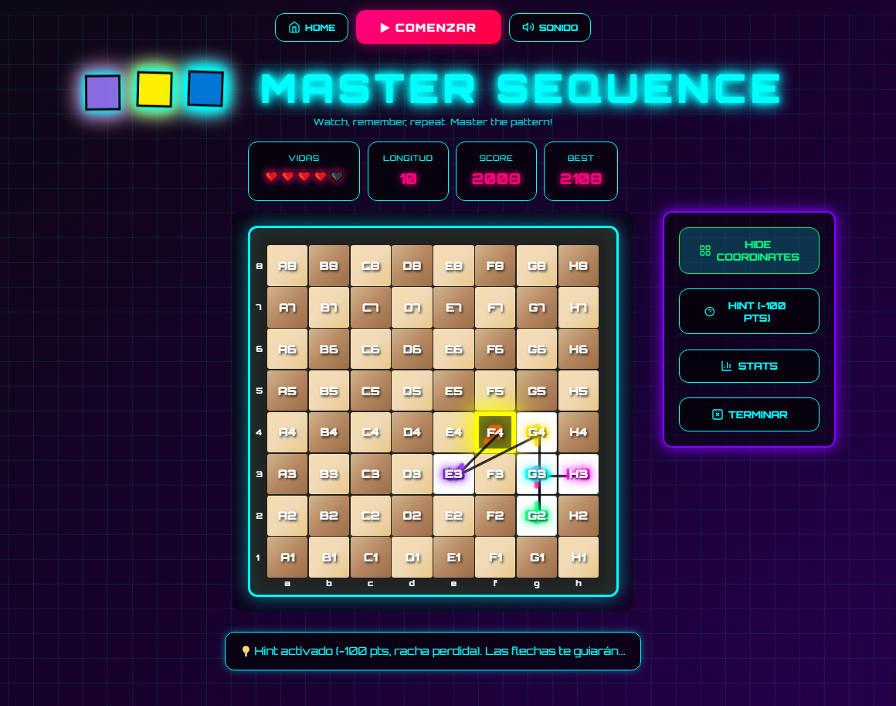

# 🕹️ ChessArcade - Level Up Your Chess Game



## 🚀 [Play Now!](https://fasmote.github.io/ChessArcade/) | [🎯 Square Rush](./games/square-rush/index.html) | [🐴 Knight Quest](./games/knight-quest/index.html) | [🧠 Memory Matrix](./games/memory-matrix-v2/index.html) | [🟦 Master Sequence](./games/coordinate-sequence/index.html)

---

## 🌐 English | Español

### 🇺🇸 **English Description**

**ChessArcade** is a collection of chess puzzle games with **neon retro-futuristic aesthetics** inspired by 80s synthwave culture. Transform traditional chess training into an exciting arcade experience with visual effects, electronic sounds, and gamification elements.

#### ✨ **Current Games Available:**
- **🎯 Square Rush** - Navigate coordinates A1-H8 in record time *(Available Now!)*
- **🐴 Knight Quest** - Master the knight's tour across pixel-perfect boards *(Available Now!)*
- **🧠 Memory Matrix** - Train positional memory with progressive levels *(Available Now!)*
- **🟦 Master Sequence** - Simon Says meets chess! Memorize growing patterns *(Available Now!)*

#### 🎯 **Features:**
- **Responsive Design**: Optimized for desktop and mobile
- **Progressive Difficulty**: From beginner-friendly to expert challenges
- **Smart Learning**: Educational gameplay with immediate feedback
- **Audio Control**: Immersive sound effects with easy toggle
- **Local Storage**: Save your best scores and progress
- **Modern CSS**: Smooth animations and neon visual effects

---

### 🇪🇸 **Descripción en Español**

**ChessArcade** es una colección de juegos de rompecabezas de ajedrez con **estética retro-futurista neón** inspirada en la cultura synthwave de los 80s. Transforma el entrenamiento tradicional de ajedrez en una experiencia arcade emocionante con efectos visuales, sonidos electrónicos y elementos de gamificación.

#### ✨ **Juegos Disponibles Actualmente:**
- **🎯 Square Rush** - Navega coordenadas A1-H8 en tiempo récord *(¡Disponible Ahora!)*
- **🐴 Knight Quest** - Domina el recorrido del caballo en tableros perfectos *(¡Disponible Ahora!)*
- **🧠 Memory Matrix** - Entrena la memoria posicional con niveles progresivos *(¡Disponible Ahora!)*
- **🟦 Master Sequence** - ¡Simon Says encuentra el ajedrez! Memoriza patrones crecientes *(¡Disponible Ahora!)*

#### 🎯 **Características:**
- **Diseño Responsivo**: Optimizado para escritorio y móvil
- **Dificultad Progresiva**: Desde principiante hasta desafíos expertos
- **Aprendizaje Inteligente**: Gameplay educativo con feedback inmediato
- **Control de Audio**: Efectos de sonido inmersivos con toggle fácil
- **Almacenamiento Local**: Guarda tus mejores puntuaciones y progreso
- **CSS Moderno**: Animaciones fluidas y efectos visuales neón

---

## 🎯 Square Rush - Perfect for Learning Chess Coordinates



### 🎮 **What is Square Rush?**
**Square Rush** is the perfect game to master chess board coordinates! Navigate from A1 to H8 in this fast-paced coordinate recognition challenge that makes learning chess notation fun and addictive.

### ✨ **Game Features:**
- **🎯 5 Progressive Levels**: From BABY STEPS (12s) to LITTLE MASTER (6s per coordinate)
- **🎮 Combo System**: Build multipliers up to x3 for higher scores
- **👶 Beginner Friendly**: Optional coordinate labels for learning
- **📱 Mobile Optimized**: Perfect touch controls for phones and tablets
- **🔊 Sound Toggle**: Immersive audio feedback with easy on/off control
- **📚 Educational**: Learn chess notation while having fun!

---

## 🐴 Knight Quest - Master the Knight's Tour!



### 🎮 **What is Knight Quest?**
**Knight Quest** challenges you to visit every square on the chessboard using only knight moves in this classic puzzle that has fascinated chess players for centuries.

### ✨ **Game Features:**
- **🏰 4 Board Sizes**: 4x4, 6x6, 8x8, and 10x10 Super Mode
- **🧠 Smart Hints**: AI-powered suggestions using Warnsdorff's algorithm
- **🏆 Ranking System**: Local leaderboards with your best performances
- **↩️ Undo System**: Take back moves to find the perfect path
- **📊 Progress Tracking**: See your improvement over time
- **🎨 Neon Aesthetics**: Beautiful cyberpunk-inspired visuals

---

## 🧠 Memory Matrix - Train Your Visual Chess Memory



### 🎮 **What is Memory Matrix?**
**Memory Matrix** challenges your ability to memorize and recreate chess positions. Watch carefully during the memorization phase, then place all pieces back exactly where they were!

### ✨ **Game Features:**
- **📊 8 Progressive Levels**: From 2 pieces (30s) to 8 pieces (10s) - increasing difficulty
- **💡 Hint System**: 6 hints per level to reveal all missing pieces temporarily
- **↩️ Undo Function**: Take back piece placements one by one
- **🎯 Smart Validation**: Real-time feedback on correct/incorrect placements
- **📱 Mobile Optimized**: Drag & drop on desktop, tap placement on mobile
- **🔊 Audio Feedback**: Synthetic sounds for glitch effects, errors, and victories

---

## 🟦 Master Sequence - NEW! Simon Says Meets Chess


### 🎮 **What is Master Sequence?**
**Master Sequence** combines the classic Simon Says game with chess coordinates! Watch the neon sequence grow, memorize the pattern, then repeat it perfectly. Each level adds ONE more square - how far can you go?

### ✨ **Game Features:**
- **📈 10+ Progressive Levels**: Sequence grows from 1 to 10+ squares with infinite mode
- **🎨 Colorful Patterns**: 8 neon colors help you memorize the sequence
- **🧠 Pattern Recognition**: Train your sequential memory and visualization
- **❤️ 3 Lives System**: Make mistakes and learn from them
- **🎯 Smart Movement**: Only king/knight moves - follows chess logic
- **🟦 Coordinate Display**: Optional coordinate labels for learning

### 🎪 **Perfect For:**
- **Memory Training**: Improve sequential memory and pattern recognition
- **Chess Visualization**: Strengthen your ability to see the board in your mind
- **All Skill Levels**: Progressive difficulty from 1 square to unlimited
- **Quick Sessions**: Perfect for 5-10 minute brain training

### 🎵 **Gameplay Experience:**
```
🟦 Level 7: Advanced
🎯 Sequence: 7 squares
❤️ Lives: 2/3 remaining
🏆 Score: 850 pts
📊 Longest: 12 squares
```

---

### 🔗 **Play All Games:**
- **🎯 [Play Square Rush](./games/square-rush/index.html)** - Master coordinates A1-H8!
- **🐴 [Play Knight Quest](./games/knight-quest/index.html)** - Conquer the knight's tour!
- **🧠 [Play Memory Matrix](./games/memory-matrix-v2/index.html)** - Train your visual memory!
- **🟦 [Play Master Sequence](./games/coordinate-sequence/index.html)** - Master growing patterns!
- **📁 [View Source Code](https://github.com/fasmote/ChessArcade)**
- **🐛 [Report Issues](https://github.com/fasmote/ChessArcade/issues)**

---

## 🛠️ **Technology Stack**

- **Frontend**: Vanilla HTML5, CSS3, JavaScript ES6+
- **Styling**: CSS Grid, Flexbox, Custom Properties
- **Audio**: Web Audio API for synthetic sounds
- **Storage**: localStorage for persistence
- **Responsive**: Mobile-first design approach
- **Performance**: Optimized for 60fps animations

## 🎨 **NeonChess Design System**

ChessArcade uses a custom **NeonChess Design System** featuring:

- **🌈 Neon Color Palette**: Cyan, Magenta, Green, Orange, Purple, Yellow gradients
- **⚡ Interactive Effects**: Hover animations, particle systems, glitch effects
- **🎵 Audio Feedback**: Synthetic soundscapes and UI sounds
- **📱 Mobile Optimization**: Touch-friendly controls and responsive layouts
- **🎯 Accessibility**: Keyboard navigation and high contrast modes

## 🚀 **Quick Start**

1. **Clone the repository:**
   ```bash
   git clone https://github.com/fasmote/ChessArcade.git
   cd ChessArcade
   ```

2. **Start local server:**
   ```bash
   # Python 3
   python -m http.server 8000

   # Node.js
   npx serve .
   ```

3. **Open in browser:**
   ```
   http://localhost:8000
   ```

## 🗂️ **Project Structure**

```
📁 ChessArcade/
├── 📄 index.html                    # Main landing page
├── 📁 assets/
│   ├── 📁 css/
│   │   └── neonchess-style.css      # Design system
│   ├── 📁 js/
│   │   └── neonchess-effects.js     # Interactive effects
│   └── 📁 images/                   # Screenshots and assets
├── 📁 games/
│   ├── 📁 knight-quest/             # ✅ Knight's Tour game
│   ├── 📁 square-rush/              # ✅ Coordinate training
│   ├── 📁 memory-matrix-v2/         # ✅ Visual memory training
│   └── 📁 coordinate-sequence/      # ✅ Master Sequence (Simon Says)
├── 📁 screenshots/                  # Game screenshots
└── 📁 docs/                         # Documentation
```

## 📸 **Screenshots**

### Square Rush


### Knight Quest


### Memory Matrix


### Master Sequence


---

## 🤝 **Contributing**

We welcome contributions! Here's how you can help:

1. **🐛 Report bugs** - Found an issue? [Open an issue](https://github.com/fasmote/ChessArcade/issues)
2. **💡 Suggest features** - Have ideas? We'd love to hear them!
3. **🛠️ Submit PRs** - Fork, create a feature branch, and submit a pull request
4. **📖 Improve docs** - Help make our documentation better
5. **🎨 Design contributions** - UI/UX improvements are always welcome

### Development Guidelines:
- Follow the existing code style
- Test on both desktop and mobile
- Ensure accessibility compliance
- Add documentation for new features

## 📜 **License**

This project is licensed under the MIT License - see the [LICENSE](./LICENSE) file for details.

## 🏅 **Achievements & Stats**

- **🎯 Games Released**: 4 (Square Rush, Knight Quest, Memory Matrix, Master Sequence)
- **⭐ GitHub Stars**: Growing!
- **🔧 Last Updated**: October 2025
- **📱 Mobile Support**: 100%
- **🌐 Browser Support**: Chrome, Firefox, Safari, Edge

---

<div align="center">

### 🎮 **Ready to Level Up Your Chess Game?**

[](./games/square-rush/index.html)
[](./games/knight-quest/index.html)
[](./games/memory-matrix-v2/index.html)
[](./games/coordinate-sequence/index.html)
[](https://github.com/fasmote/ChessArcade)

**Made with ⚡ by ChessArcade | Powered by NeonChess Design System**

</div>
